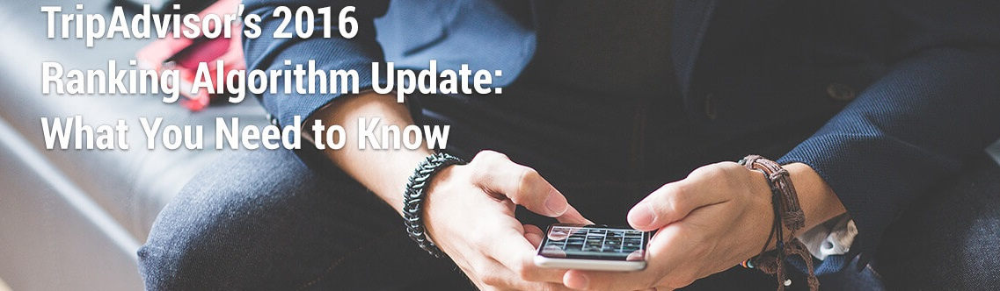

## TripAdvisor  Scenario Design analysis

1) Who are the target users?

TripAdvisor's target users are the people traveling for vacations.

2) What are the key goals?

Satisfy travel's needs on transportations, hotel bookings, sightseeing, and restaurant selections.

3) How can I help to accomplish those goals? 

Analyze traveler behaviors and tailor trip plans for them.

## Reverse engineering

The current ranking system takes into account the below three factors: 

1. Quality of reviews: Obviously, positive reviews are important. However, it's unclear what makes a positive review particularly qualitative.
2. Quantity of reviews: The more reviews you have, the higher you rank.
3. Age of reviews: Recent reviews are prioritized, and older reviews have less impact over time.

There is much to do by creating a customer-centered recommendation system, so travelers feel more relevant with the recommender system.

## Recommendations

In 2016, TripAdvisor revised their Popularity Ranking Algorithm to fit better customers' needs, but without customization based on customers' behavior analysis and build a predictive model in giving recommendations, there is still long way to go in touching customers' hearts. My recommendation based on the shopping experiences with TripAdvisor:

1. Know who I am. Based on my hotel search and resort browsing to estimate my economic status and personal preferences. Recommend the hotels and resort places on the same scale over time.

2. Know what I like. Restaurants, cuisines, in-door, out-door activities. Hotel style and favorite vacation spot. Whom I would like to travel with, and duration of the trip. If I would like to stay in one place or multiple places at a time.

3. Know my vacation pattern, and recommend tailored trip plan. How often do I travel each year, and what are the places I visit more often. Using Cookies to track sessions of each visits, build a profile under my name, predict next vacation places, activities, and spending.

